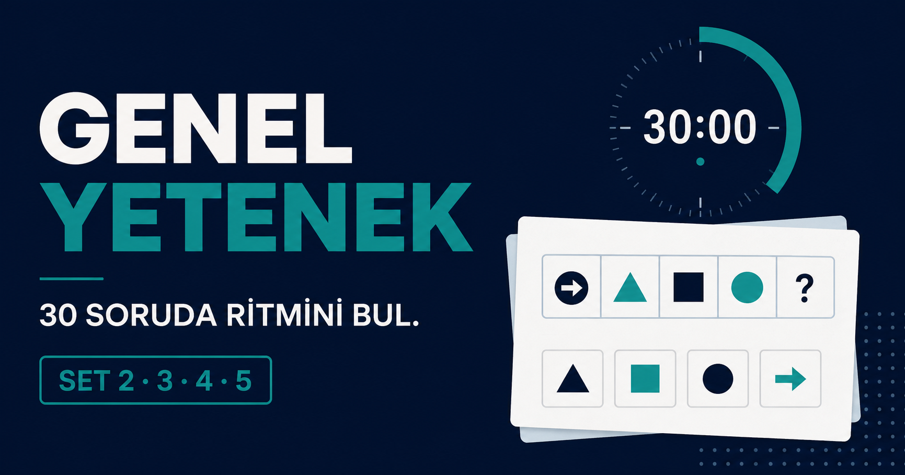

# Logic Interview Test App

Türkçe genel yetenek ve mantık mülakatlarına hazırlanmak için geliştirilmiş, sayaçlı bir deneme uygulaması.



## Özellikler

- Set 1–5 arasında toplam 150 özgün soru
- Her set için 30 soru ve 30 dakikalık sayaç
- Sayısal, sözel, çıkarım ve görsel akıl yürütme soruları
- Gerçek geometrik şekillerle hazırlanmış matris ve örüntüler
- Soru haritası, önceki/sonraki gezinme ve klavye kısayolları
- Cevapların cihazda otomatik korunması
- Doğru, yanlış, boş ve süre bazlı sonuç özeti
- Sınavdan çıkış öncesi güvenli onay ekranı
- Masaüstü ve mobil uyumlu tasarım

## Yerel Çalıştırma

Node.js `22.13.0` veya üzeri gereklidir.

```bash
npm install
npm run dev
```

Ardından tarayıcıda `http://localhost:3000` adresini açın.

Üretim derlemesini kontrol etmek için:

```bash
npm run build
```

## Teknolojiler

- React 19
- TypeScript
- Vinext / Vite
- CSS
- Tarayıcı `localStorage` desteği
